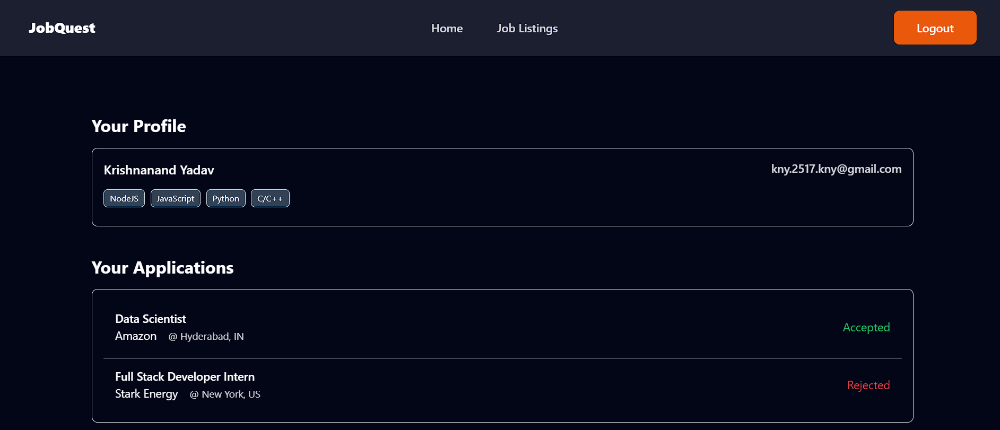
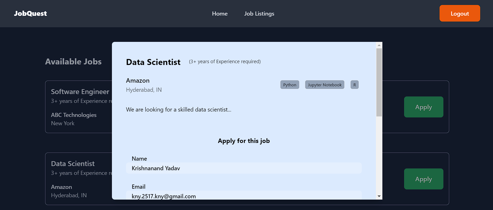

# JobQuest

JobQuest is a 'Job Portal' web application made using Java SpringBoot and ReactJS.

## Table of Contents

- [Demo](#demo)
  - [Screenshots](#screenshots)
- [Features](#features)
- [Technologies Used](#technologies-used)
- [Running the Project Locally](#running-the-project-locally)

## Demo

You can check out the live demo of JobQuest [here](https://job-quest-client.vercel.app/).

### Screenshots



---



---


## Features

- Candidates can
  - apply to posted jobs
  - keep a watch on their job applications' status
- Recruiters can
  - post and delete jobs
  - accept or reject job applications from candidates

## Technologies Used

### Frontend

- [React](https://react.dev/)
- [TailwindCSS](https://tailwindcss.com/) for styling
- [Axios](https://axios-http.com/docs/intro)
- [Redux Toolkit (RTK)](https://redux-toolkit.js.org/)
- [Redux Persist](https://redux-toolkit.js.org/rtk-query/usage/persistence-and-rehydration)

### Backend

- [Spring Boot](https://spring.io/projects/spring-boot)
- [Spring Security](https://spring.io/projects/spring-security)
- [Spring Data MongoDB](https://spring.io/projects/spring-data-mongodb)

## Running the Project Locally

These instructions will help you set up a copy of the project on your local machine.

### Prerequisites

Before getting started, make sure you have the following installed on your machine:

- [Node.js version 18.15.0 (or higher)](https://nodejs.org)
- [JDK (Java Development Kit) 17](https://www.oracle.com/in/java/technologies/downloads/#java17)
- [Maven](https://maven.apache.org/download.cgi)

### Installing & Usage

1. Clone the repository to your local machine:

   ```bash
   git clone https://github.com/Krishnanand2517/job-quest-java
   cd job-quest-java
   ```

1. Navigate to the backend directory `jobquestbackend` & open the folder in any IDE configured for Spring Boot (preferably IntelliJ IDEA).

1. Sync all the Maven dependencies.

1. Copy the environment variables from `.env.sample` to a new file `.env`:

   Obtain the values and API keys for the variables from their respective sources.

1. Once you have setup the project and its dependencies, you can run the server.

   This will start the backend server on port 8080, and you can access it in your web browser at http://localhost:8080/.

   Check it by navigating to http://localhost:8080/api/v1/jobs !

1. Navigate to the frontend directory and install project dependencies:

   ```bash
   npm install
   ```

1. Run the development server for frontend:

   ```bash
   npm run dev
   ```

   This will start the frontend server on port 5173, and you can access the web app in your web browser at http://localhost:5173

### Contribute

If you encounter any issues, have suggestions, or want to contribute, feel free to open an issue or submit a pull request. Happy coding!
